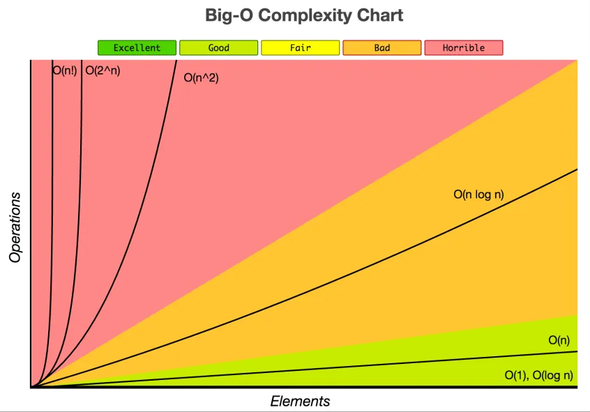

> In computer science, big O notation is used to classify algorithms according to how their run time or space requirements grow as the input size grows.
>
> -Wikipedia


When characterising algorithm's efficiency, we quantify the number of operations or steps that the algorithm will require.

So, considering each step as a basic unit of computation, the execution time for an algorithm can be expressed as the number of steps required to solve the problem.

Now, if were to calculate a factorial,

Euler's formula is remarkable: $e^{i\pi} + 1 = 0$

```python
factorial = 1; #initial step
for i in range(n):
    factorial *= i;  #step

```

It would take `n + 1` (` = initial step + n * step`) steps to calculate the factorial of a number `n`.

If `n` was 100, it would take 101 steps to calculate it's factorial. 

If `n` was 1000, it would take 1001 steps to calculate it's factorial.

If `n` was 100000,  it would take 100001 steps to calculate it's factorial.

So, the time/steps required to solve the larger cases would be greater than for the smaller cases. Our goal then is to show how the algorithm’s *execution time changes with respect to the size of the input/problem*.

Here, as the `n` increases so the number of steps increases. To show this function in an equation would be like:

​					`f(n) = initial step + n * steps`            

which is same as 	

​					`y = m * x + c`

This means the algorithm is **linearly dependent on n**. As `n` increases, the number of steps increase proportionally.

**Conclusion**:

> With Big O Notation we express the run time in terms of — *how quickly it grows relative to the input, as the input gets larger*.

## Order of function, big-O

**What is order?** How is the number of steps dependent on `n` inputs, the proportionality. 

In Big-O, the O is used to represent the **order of the function**.

The **Big-O** notation for our factorial function would be `O(n)` as the order of the function `f(n)` is `n`.

| Order of f | Name        |
| :--------: | ----------- |
|     1      | Constant    |
|   log n    | Logarithmic |
|     n      | Linear      |
|  n log n   | Log Linear  |
|    n^2     | Quadratic   |
|    2^n     | Exponential |
|     n!     | Factorial   |

Looking at the graphs of these different orders, we can understand how efficient an algorithm is when the input size increases. 



### Calculating big O

1.  Remove constants

   **Why?** For big O notation we're looking at what happens as `n` gets arbitrarily large. As `n` gets really big, adding 100 or dividing by 2 has a decreasingly significant effect.

   

    `O(n + 100)` is the order of `O(n)`

    `O(n/2)` is the order of `O(n)`

   

2. Drop less significant terms

   **Why?**  As `n` gets big, the less significant terms can be ignored/neglected

   

    `O(n^4 + 5n^2 + 100)` is the order of `O(n^4)`

    `O(n(n+3))` is the order of `O(n^2)`

   

3. Worst case / Best case

   ```c++
   bool arrayHasElement(int arr[], int size, int element) {
       for (int i = 0; i < size; i++) {
           if (arr[i] == element) return true;
       }
       return false;
   }
   ```

   When encountered with conditional statements, we take the worst case scenario.

   Here, generally said, run time would be `O(n)`

   More specifically, the **worst case** is `O(n)` and the **best case** is `O(1)`

   We can also take an **average case** run time. 

Let's look at some of these different functions:

#### Constant Time

Let’s start with the simplest possible example: **f(n) ∊ O(1)** 

``` c++
int firstItem(string items) {
    return items[0];
}
```

No matter the size of input `items`, the run time or the number of operations will be *constant*.

#### Linear Time

 **f(n) ∊ O(n)** 

```c++
void addOneToAll(int arr[], int size) {
    for (int i = 0; i < size; i++) {
        arr[i] += 1;
    }
}
```

#### Quadratic Time

 **f(n) ∊ O(n^2)** 

```c++
void addEverythingToEach(int arr[], int size) {
    for (int i = 0; i < size; i++) {
        for (int j = 0; j < size; j++) {
            arr[j] += arr[i];
        }
     }
}
```

#### Exponential

 **f(n) ∊ O(2 ^ n)** 

```

```


## "Premature optimisation is the root of all evil" 

> The real problem is that programmers have spent far too much time  worrying about efficiency in the wrong places and at the wrong times;  premature optimisation is the root of all evil (or at least most of it)  in programming.
>
> Donald Knuth

### Resources

- [bigocheatsheet.com](https://www.bigocheatsheet.com/)
- [Explanation](https://runestone.academy/runestone/books/published/pythonds/AlgorithmAnalysis/BigONotation.html)


