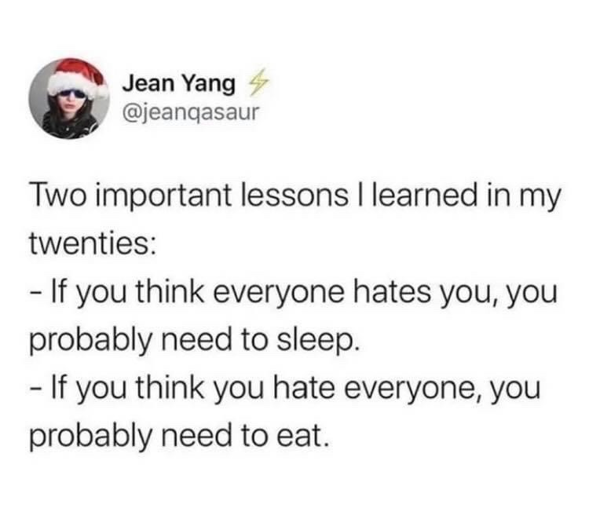

# The Defining Decade 20

I recently turned twenty one and my sister gifted me a book "The Defining Decade 20: Why Your Twenties Matter and How To Make The Most Of It" by Meg Jay. It's a book written for people in their twenties (aka "twentysomethings") and I found some good realistic helpful life advices. Here, I summerized it's lessons about career in hopes that it could help others who read this.

The book's blurb:

> Our "thirty-is-the-new-twenty" culture tells us that the twentysomething years don't matter. Some say they are an extended adolescence. Others call them an emerging adulthood. But thirty is not the new twenty. In this enlightening book, Dr. Meg Jay reveals how many twentysomethings have been caught in a swirl of hype and misinformation that has trivialized what are actually the most defining years of adulthood. Drawing from more than ten years of work with hundreds of twentysomething clients and students, Dr. Jay weaves the science of the twentysomething years with compelling, behind-closed-doors stories from twentysomethings themselves. She shares what psychologists, sociologists, neurologists, reproductive specialists, human resources executives, and economists know about the unique power of our twenties and how they change our lives. The result is a provocative and sometimes poignant read that shows us why our twenties do matter. Our twenties are a time when the things we do--and the things we don't do--will have an enormous effect across years and even generations to come.

## Identity Capital

Identity capital is our collection of personal assets. These are the investments we make in ourselves, the things we do well enough, or long enough, that they become a part of *who we are*. It can be degrees, jobs, clubs, how we speak, where we are from, how we solve problems, how we look. 

Identity capital is how we build ourselves bit by bit, over time. Most important, it is what we bring to the adult marketplace. 

Researches looked at how people resolved identity crisis and found that lives that are all capital and no crisis— all work and no exploration—feel rigid and conventional. But more crisis than capital is a problem too. So, twentysomethings who take the time to explore and also have the nerve to make commitments along the way construct strong identities. They have higher self-esteem and are more persevering and realistic. It leads to positive outcomes, including a clearer sense of self, greater life satisfaction, better stress management, stronger reasoning, and resistance to conformity. 

Economist and sociologists agree that twentysomethings work has an unusually great influence on our long-run career success. Statistics say, for most, about two-third of lifetime wage growth happens in the first ten years of the career. Twentysomething's life gets going when we use the bits of identity capital we have to get the next piece of capital we want.    

## Weak Ties

The urban tribe, or the make-shift family of close friends that we create, provide a crucial supportive role and lots of good times. They may bring us soup when we are sick, but it is the people we hardly know who will swiftly and dramatically change our lives for the better. 

Granovetter wrote a ground-breaking paper on "The Strength of Weak Ties" that not all relationships are created equal. They get stronger with time and experience. 

Weak ties feel difficult to talk to, but that's the point. They know things that we don't know. Information and opportunity spread faster through weak ties because they have fewer overlapping of contacts. 

They force us to communicate from a place of difference, to use what is called elaborated speech. We need to be more thorough when we talk to weak ties, and this require more organisation and reflection.

Alumni networks from college and high schools can be really helpful, and if there's isn't an official network, go through Facebook or LinkedIn groups for your school. If there is someone who does something you want to do, email them for an "informative interview". This is what ultimately everyone does. 

The Benjamin Franklin Effect: Franklin tried to gain favour of a gentleman by paying servile respect but never got attention. He then searched a rare book that the gentleman owned and asked to borrow it to read, and returned it a week later. The gentleman noticed him, later when they met, in contrast to being ignored of his presence like other times. He learnt, "He that hath once done you a kindness will be more ready to do you another than he whom you yourself have obliged." If we do someone a favour, we come to like them. It's called foot-in-the-door technique of asking small favours before larger ones. It works because it feels good to help— unless what they ask for is overwhelming. 

Franklin did research on his target. He made himself interesting. He made himself relevant. And he defined a clear favour: the use of a book.

When weak ties help, the community around us feel less impersonal. Suddenly, the world seems smaller and easier to navigate. The more we know about the way things work, the more we feel a part of things.

## The Unthought Known

While making decisions it might feel like you are in a middle of an ocean and can swim in any way, i.e. too many choices. But it's important to realise that is an illusion.

In thinking that we have too many choices, we pretend that there is no particular life we want to live. We avoid knowing what we know. We have experiences, interests, strengths, weaknesses, diplomas, hang-ups, priorities. Our years until now are relevant.

We are told abstract quotes like "You're the best! The sky is the limit" or "Follow your dreams" or "Reach for the stars!" with no instructions on how to do it. 

Life isn't the lottery question, i.e. what would you do if you won a lottery. That's not reality. Talent and money do matter. The question we need to ask is: what would we do if we *didn't* win the lottery. What might you be able to do well enough to support the life you want? And might enjoy enough that you don't mind working at it in some form or another for years to come? 

Psychologist Christopher Bollas introduced the concept of "unthought known", the things we know about ourselves but forget somehow. These are the dreams we have lost sight of or the truths we sense but don't say out loud. We are afraid of acknowledging them because we fear what other people might think, and more often of what the unthought known will mean for ourselves and our lives. So, we pretend that not knowing what to do is the hard part when, somewhere inside, we know that making a choice about something is when the *real* uncertainty begins. It is working towards something even though there is no sure thing. When we make choices, we open ourselves up to hard work and failure and heart-break, so sometimes it feels easier not to know, not to choose, and not to do. But it isn't the easier choice. 

Not making choices isn't safe. The consequences are just further away in time, like in your thirties or forties.  

## The Search for Glory and The Tyranny of the Should

Some twentysomethings dream too small, not understanding that their twentysomething choices matter and are, in fact, shaping the years ahead. Others dream too big, fueled more by fantasies about limitless possibilities than by experience. Working towards our potential becomes a search for glory when, somehow, we learn more about ideal than about what is real. Our parents tell us more about what we *should* be like than what we are like. Scrambling after ideals, we become alienated from what is true about ourselves and the world.

Shoulds can masquerade as goals of high standards, but they are not. Goals direct us from the inside, but shoulds are paralysing judgements from the outside. Goals feel like authentic dreams while shoulds feel like oppressive obligations. Shoulds set up a false dichotomy between either meeting an ideal or being a failure, between perfection or settling. 

Twentysomethings worry about selling themselves short or not reaching their potential, but they need to stop worrying about how life is supposed to look. Social media can be one more way of *keeping* up with not just our close friends, but with hundreds of others whose manufactured updates continually reminds us of how glorious life should be. They need to ask if what they *should* be doing is something they *want* to do, and plans for what they *need* to do to achieve that.

## The Customised Life

Many twentysomethings are told "You can be anything!", and the concept of *anything* sounds exciting and limitless. They are hyped to be different and not have "some office job and work nine to five like everyone else". Different-ness is what makes us who we are. We mark ourselves as not-this or not-that, but the self-definition cannot end there. An identity or a career cannot be built around what you don't want. We have to shift from a negative identity, or a sense of what one's not, to a positive one, a sense of what one is. *This take courage.* 

It might feel like when claiming one option, one is losing everything else. But it's not about settling but starting. It might be hard to think all over again when changing professions in future but it'll be easier then because you would know from experience that what actions needs to be taken.

As a twentysomething, life is more about potential than proof. So, a good story goes a long way in these years than in other time in life. If the first step in establishing a professional identity is claiming our interests and talents, then the next step is claiming a story about our interests and talent, a narrative we can take with us to interview and coffee dates. *How does what you did before relate to what you do now, and how might that get you to what you want to do next?* 

> We are born not all at once but by bits. - Mary Anti

---

The book is divided into three sections: "Work", "Love", and "The Brain and the Body". This article concludes the Work section, and I recommend everyone read the book to check out the other two sections. While I wrote the gist of the one third of the book, the author (who is a psychologist) uses examples of her patients which seem much more effective way to understand the point. Like any other self improvement book, do take the advice in it with a grain of salt and spend some time thinking about what's relevant and helpful to you.

Let's end this with some real wisdom:

Thanks for reading!
