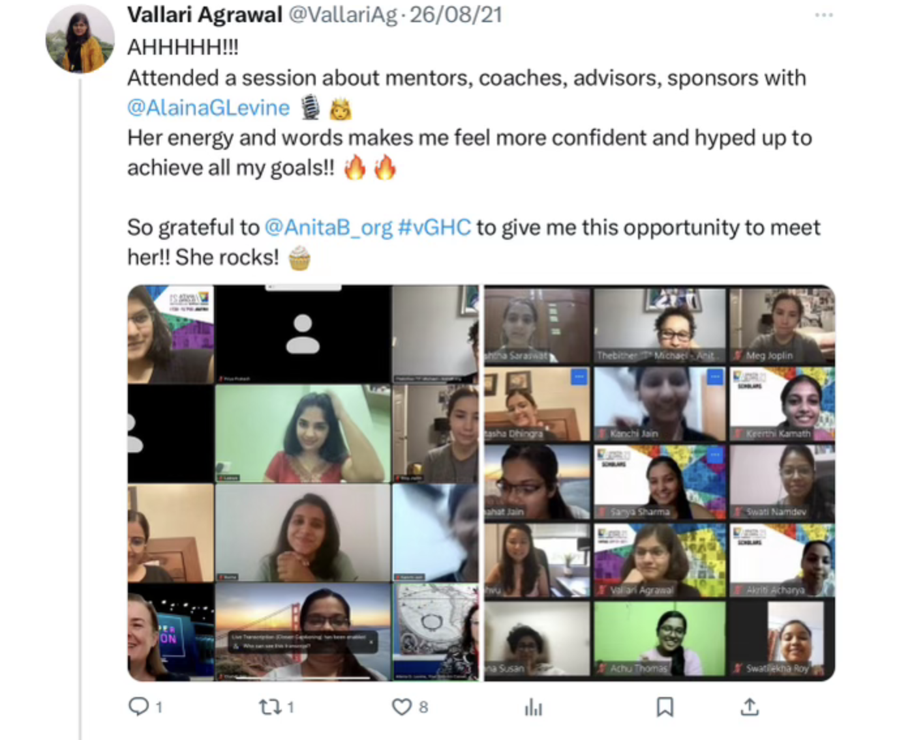

In this space, I'll be unfolding my journey through various open-source programs. I'll be skipping the technical nitty-gritty because I want the spotlight on the journey itself.

### Google Summer of Code and Outreachy

In the midst of the pandemic in early 2021, during my second year of college, I started exploring open-source projects. I checked out projects like [Internet Archive](https://github.com/internetarchive), [Postman](https://github.com/postmanlabs), and [Oppia](https://github.com/oppia/oppia). 

In the first couple of months of that year, I began exploring good-first-issues and contemplated applying for the GSoC/Outreachy programs. However, I soon faced a few _minor_ obstacles - they ranged from my laptop not having enough resources to handle running a huge project like Oppia (to be fair, it couldn't handle a Figma tab either), to my becoming one of the unfortunate statistics of people infected during the deadly second wave of COVID in India in Marchh. 

Later in the year, I upgraded the memory of my laptop and switched out the old hard-disk with a new SSD, as I continued to explore projects which seemed interesting to me. In particular, I liked [Gitlab](https://gitlab.com/gitlab-org/gitlab) which had good local setup and documentation to work with, even though it used technology like Ruby and Vue which I had never used by then. While working through the process of learning and building Ruby projects, I reached out to Gitlab's last year's intern on LinkedIn and asked about their experience. 

By late December 2021, Gitlab had initiated a discussion on a open issue about potential internship projects for 2022. As I grappled with understanding the problem statement and Ruby/Vue codebase, I decided to move onto something within my knowledge of tech stack. My sister was a past intern at [Ceph](https://github.com/ceph) and so she encouraged me to check that out next. 

By early 2022, I saw a list of GSoC projects posted by Ceph and found one called "Visualization of Ceph Cluster" with Ceph's Dashboard team. It was in the sweet spot of my interest and within my technical knowledge of Angular which I had used for few projects in my first year of college. So, I contacted the mentors and they guided me and patiently reviewed my first few good-first-issues PRs on the Dashboard. I researched and compared visualization tools, exploring different approaches to solving the problem statement. 

After my initial application for Outreachy was accepted, and the project list for Outreachy projects with Ceph was released, and that's when I discovered that the Visualization project was not included. I decided to submit my proposal as a GSoC intern instead, while also exploring the Ceph projects that were part of Outreachy. One of them was called "Making Teuthology a better detective" with a different team at Ceph. The problem statement looked approachable and I was comfortable writing Python (teuthology codebase is entirely written in Python). So I reached out to the mentors of the teuthology project and they shared a list of evaluation tasks. By the time the application deadline came, I had proposals ready for both the projects so I submitted them and got selected for both.

![[outreachy-email.png]](./outreachy-email.png)

I remember being stressed during my contribution period of Feb-April 2022. I had somehow managed to again get COVID in January 2022 and then declined a Ruby internship offer to focus on my two work-in-progress Ceph projects and recently resumed offline college classes. I can't advise on stress-management but I can recommend trying your best, taking breaks, and talking with personal mentors. The advise that had the biggest impact on me was "Start before you're ready" which encourages learning by getting your hands dirty.

After some deliberation, I decided to withdraw from the Ceph Dashboard GSoC project and only do the Outreachy internship over the summer because I wanted to focus on one project and give that my best effort. I saw great opportunity and growth in both the projects but because I wouldn't be able to apply for Outreachy again later (since past-GSoC applicants are illegible for Outreachy), I decided to go with Teuthology Project with Outreachy for that year. 

**Internship**:

Throughout my internship, I was fortunate to have incredibly supportive mentors who guided me every step of the way. We had meetings every Mondays and Wednesdays, and I kept them updated via email on my progress. They appreciated even subtle techniques in my code and gave me the freedom to learn through trial and error.

As the internship progressed, I began to wonder if I could contribute to other areas of the codebase beyond my assigned project and my mentors shared few issues that I could work on. One of these tasks involved automating a manual aspect of a workflow. From this, an idea to create an API for teuthology came about, and my mentors encouraged me to explore FastAPI for its implementation. I spent the rest of my internship building basic features of teuthology-api and continued work on my internship project. 

Ceph's core team recognized the potential of my internship project and suggested enhancing its functionality for broader use. After my internship ended, I continued work on the internship project and teuthology-api for which I felt a sense of ownership and responsibility. 

I also got the opportunity to give a virtual Ceph Talk where I showcased my internship project to the Ceph team, you can find it on Youtube [here](https://www.youtube.com/watch?v=hPt0WbYtDxA). I ended up changing the implimentation significantly after this talk, which solved the problem even more efficiently.

### Grace Hopper Conference's Open Source Day

Unlike Google Summer of Code and Outreachy internship programs, Grace Hopper's Open Source Day is an one-day virtual hackathon where participants get the opportunity to contribute to open-source project with help of the maintainers.

In 2021, I discovered [Grace Hopper Celebration](https://ghc.anitab.org/) Conference and submitted my essays for scholarship. One of my college professor provided me with a letter-of-recommendation and I was fortunate to be accepted as a scholar to attend virtual GHC Conference 2021. It was an exciting opportunity to network, one-on-one or in groups or even being invited onto the virtual stage, with a _lot_ of people from all over the world and with different stories. 

On the last day of the conference, interested people participated in Open Source Day. We were provided with a list of projects to choose from. For our chosen project, we could join the Zoom breakout sessions where the maintainers assisted us in setting up and getting started.

I thought that [greenpeace](https://github.com/greenpeace/planet4) sounded like an organization working towards a good cause and joined their session. There were a couple of project maintainers who shared a few issues we could work on and remained on the call while we poked around with it. Personally, we struggled a _lot_ to get things setup and unfortunely weren't able to get much done in that one day of timeframe. I ended up connecting with other contributors working on similar tracker issues and it became the most unique networking experience. 

---

Thank you for reading my story of navigating open-source programs. I hope future applicants find some helpful tip in here.

So long, and thanks for all the fish! 🐬

---

You can reach out to me via email at _vallariag+blog@gmail.com_, or:
- LinkedIn: [linkedin.com/in/vallariag](www.linkedin.com/in/vallariag)
- Twitter: [twitter.com/VallariAg](https://twitter.com/VallariAg)

