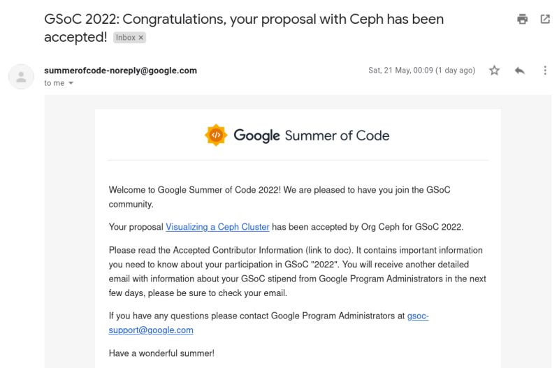

During pandemic in early 2021 when I was in second year of my college, I started exploring open-source projects. I checked out projects like [Internet Archive](https://github.com/internetarchive) , [Postman](https://github.com/postmanlabs) , and [Oppia](https://github.com/oppia/oppia). That year, when applying for the programs, I faced some minor obstacles which ranged from my laptop not having enough resources to handle running a huge project like Oppia (to be fair, it couldn't handle a Figma tab either), to me becoming one of the depressing numbers of infected people in the second wave of COVID in India. Later in the year, I upgraded the memory of my laptop and also explored other projects like [Gitlab](https://gitlab.com/gitlab-org/gitlab) which seemed interesting with good local setup and documentation, but used technology like Ruby and Vue which I had never used by then. While struggling my way around building Ruby projects, I reached out to Gitlab's last year intern and asked about their experience. Eventually, I decided to move onto something within my knowledge of tech stack. My sister was a past intern at [Ceph](https://github.com/ceph) and so she encouraged me to check that out next. 
By early 2022, I saw a list of GSoC projects posted by Ceph and found one "Visualization of Ceph Cluster" project right in the sweet spot of interesting and within my technical knowledge of Angular which I had used for few projects in my first year of college. So, I contacted the mentors and they guided me and patiently reviewed my first few good-first-issues PRs for Ceph Dashboard. After my initial application for Outreachy was accepted, when the project list for Outreachy projects with Ceph were released, the Visualization project was not part of them. I decided to submit my proposal as GSoC intern instead, meanwhile I looked at the Outreachy ceph projects. One of them was called "Making Teuthology a better detective" with a different team at Ceph which used Python. I reached out to the mentors of the teuthology project and they shared a list of tasks to do. By the time the application deadline came, I had proposals ready for both the projects so I submitted them and got selected for both.

![[outreachy-email.png]](./outreachy-email.png)

Though humans tend to forget/undermine their own past struggles, I do remember being stressed during my contribution period of Feb-April. I had somehow managed to again get COVID in January 2022 and then declined a Ruby internship offer to focus on my two work-in-progress Ceph projects and college. I can't advise on stress-management but I can recommend trying your best, taking breaks, and talking with your personal mentors. The advise that had the biggest impact on me was "Start before you're ready" which encourages learning by getting your hands dirty.

After some discussions and deliberation, I decided to withdraw from the GSoC project and do the Outreachy internship over the summer because I wanted to focus on one project and give that my best effort. During my internship, all of my mentors were kind and helped me enormously as I struggled with the workings of the project. They appreciated even subtle techniques in my code and gave me the freedom to learn through trial and error.

