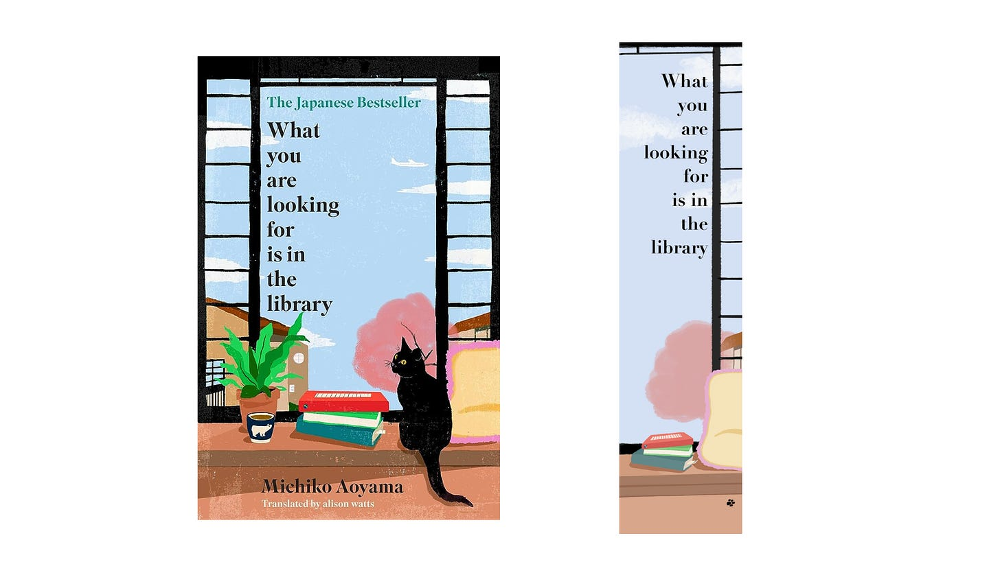
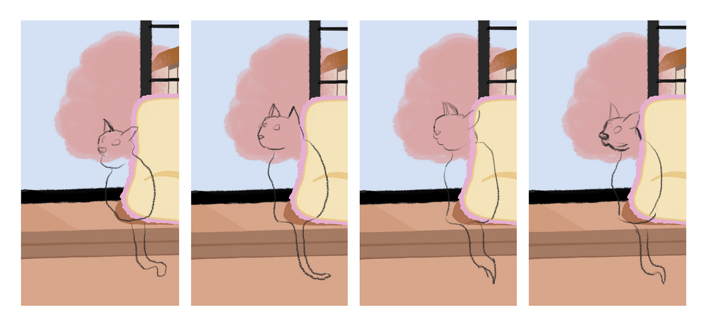
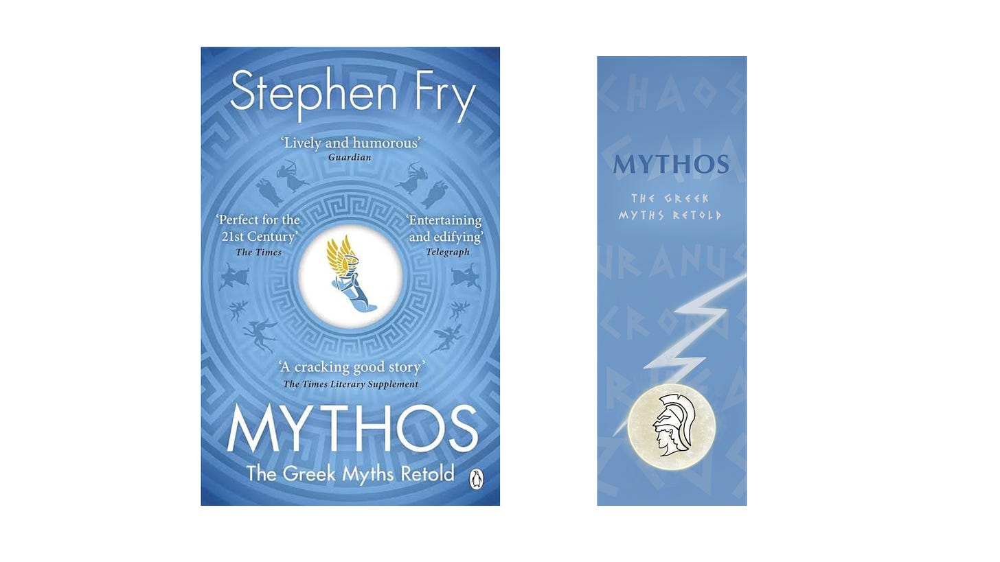
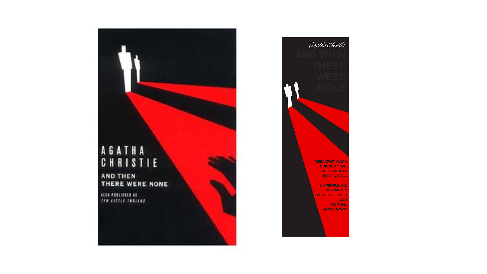
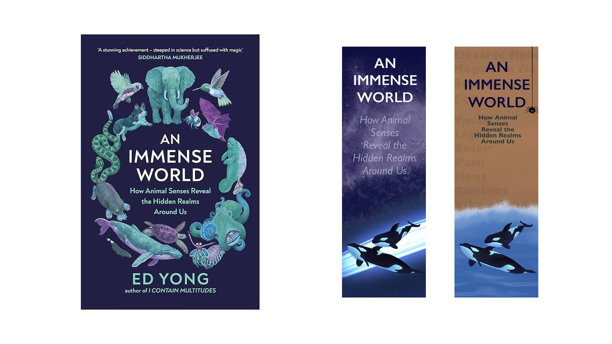
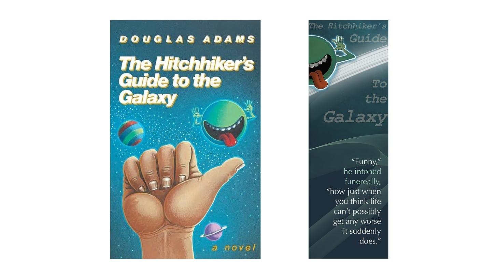

In this post, I’ll be sharing a few bookmarks that I’ve designed based on _**FIVE**_ books that I really loved reading and would recommend anyone in a heartbeat.  

You can download all the bookmarks from [here](https://drive.google.com/drive/folders/1-IZ2KIM3SM9G4o5evtA4OiiELF7oVCmP). 

### #1. What you are looking for is in the library 
 

I brought this book mostly because of it’s _beautiful_ calming cover, and I was surprised when it turned out to be a heartwarming and cosy read. In fact, I finished this book just a couple days ago and it’s already on my favourite shelf!  

This book has five stories, each written from a new character’s perspective. Each story follows a person who feels stuck in life or downhearted over unrealised dreams/plans, and then they find hope in a book recommended by a librarian and an compassionate conversation with a friend. These five characters are in very different stages of life (from twenty-two year old woman to 70 year old retired man), yet the reader is able to relate and understand their internal struggles.  

My overall takeaway: be more compassionate in life and help yourself in finding hope to start anew.  

After reading this, you would understand why people say “books are man’s best friend” because this book is just that!  

Now, let’s address the elephant in the room… the cat. If you are wondering why I didn’t include the cute cat from the book cover in the bookmark, I hope the below image answers that question for you.  

 

And these are my best attempts - one time, it actually looked like a frog! It _never_ occurred to me how difficult it is to draw a cat which _isn’t_ a circle with two triangle ears and three squiggly whiskers! So, I settled for a cute little paw print. We’ll pretend that’s… uhhh… an artistic _choice_.  

View this book on goodreads: [link](https://www.goodreads.com/book/show/91274427-what-you-are-looking-for-is-in-the-library).  

### #2. Mythos 
 

This book has the most amazing story telling. Of course, Greek Mythology is known for it’s interesting stories but Stephen Fry has stitched these up together in a flow so well in this book.  

He explains all characters in a chronological timeline- starting from Chaos to birth of all gods, and later goes into stories about lesser known characters and tales. I recommend this to everyone regardless of their pre-existing knowledge about Greek mythology. I also got to learn about origin of few modern words and symbols from some of the stories (for example, the story behind the two serpents symbol of hospitals).  

 

I had a friend back in school with whom I used to discuss at LENGTH about Percy Jackson series when I was reading them. She used to love Artemis, so I drew her instead of Hermes’ Sandals on the bookmark.  

View this book on goodreads: [link](https://www.goodreads.com/book/show/35074096-mythos). 

### #3. And Then There Were None 
 

Agatha Christie is the best when it comes to cozy murder mystery books. It’s easy to read, thrilling, and has just the perfect amount of murders. It’s gripping and never gets boring.  

Another book I loved from the author is “Murder on the Orient Express” - it’s well-deservingly famous and a fun read. Also, it has one of the most brutal insult I’ve read in a book: 

“What’s wrong with my proposition?” Poirot rose. “If you will forgive me for being personal- I do not like your face, M. Ratchett.” 

- Murder on the Orient Express, Agatha Christie  

I have been wanting to make this bookmark from a long time now. Red, black, and white colour combination is one of the most striking and powerful combination because it creates mystery and drama like no other.  

View this book on goodreads: [link](https://www.goodreads.com/book/show/16299.And_Then_There_Were_None). 

### #4. Immense World 
 

This book is the perfect book for people who are curious about animals. While we have a lot of senses, vision is a primary sense for humans, so we perceive the world first through our eyes. In our communication, visual metaphors are particularly common, for example we say “do you _see_ my point?”, “_vision_ board”, “in hind_sight_” etc.  

Meanwhile, other species have evolved to perceive the world differently compared to our limited window. Each of the chapters in this book are on a new sense - like taste, sound, etc. It’s packed with new interesting facts which are told in a beautiful flow - it’s very well written and edited.  

This book has given me the knowledge of most amazingly bizarre facts. For example, an ant’s primary sense is smell- in one research study, a drop of chemical (which is released from ants after their death) was intentionally poured over on a live ant to see the reaction of other ants, and interestingly they all treated that ant like it’s dead and carried it away even when it moved around it’s arms! _Crazy, right?_ Definitely ruined that poor ant’s life, but it also shows how dependent we are on our senses. Reality is only what we are able to perceive. This book is full of research stories like above.   

I used to listen to this book on audible all the time in my final year of college. After college ended, I got a paperback copy and found that there were few pictures in the middle of the book of some of the animals it talked about. So I’d recommend a physical copy, if you want that.  

The blue bookmark is for the ones who prefer to stick to the colour scheme of the book cover (me!).  And the other one is simply a slightly more realistic version where Orcas aren’t flying in space. It also has all the chapter names in the sand if look closer.  

View this book on goodreads: [link](https://www.goodreads.com/book/show/59575939-an-immense-world). 

### #5. Hitchhiker’s guide to the galaxy 
 

Finally, we come to the _best_ of the best- Hitchhiker’s Guide. The humour in this book is the most random - you can never guess where a sentence is going. If you are into intergalactic bizarre stories, this is gold for you.  

There’s a character called “Marvin” who is a depressed and bored robot with a super intelligent brain (as big as a planet, apparently). You just know every page this character is on is going to make you laugh. Every character in this series is weird and funny in their own way, I cannot pick favourites.  

I absolutely refuse to watch it’s movie because I don’t want to destroy the imagination I have of the novel, but I recently found out that Alan Rickman voiced Marvin’s character. I am still not going to watch it but just imagining that makes me laugh even more.  

The quote in the bookmark is from Marvin - “he intoned funereally” somehow seems to sum-up his character pretty well!  

People love to analyse this book to find deeper meaning in it’s silliness - I have read a lot of theories and I love all of them. To avoid spoilers, I won’t mention them here.  

View this book on goodreads: [link](https://www.goodreads.com/book/show/11.The_Hitchhiker_s_Guide_to_the_Galaxy). 

--- 
 

If you’re interested to know, I created these bookmarks using the [Procreate](https://procreate.com/) software. All of the brushes were part of the default pack that comes with the app. Only external thing was the greek lettering font which I downloaded from [here](https://www.fontspace.com/spartacus-font-f115964) (cool name: spartacus-font). And that’s it!  

Here’s the link to download all the bookmarks again: [link](https://drive.google.com/drive/folders/1-IZ2KIM3SM9G4o5evtA4OiiELF7oVCmP).  

--- 
Thanks for reading - hope you enjoyed this post! 

