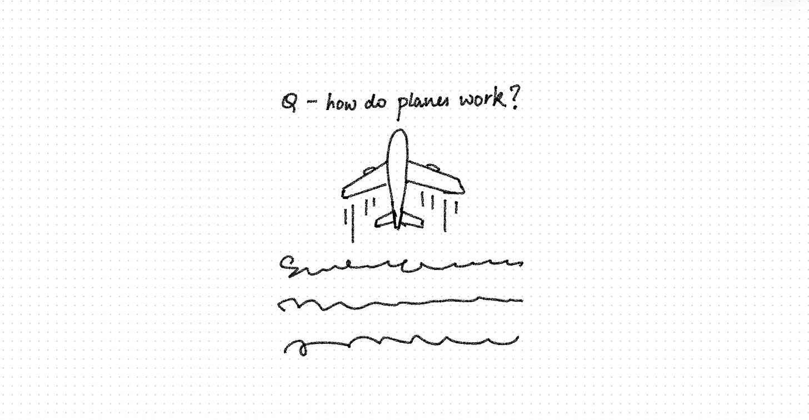
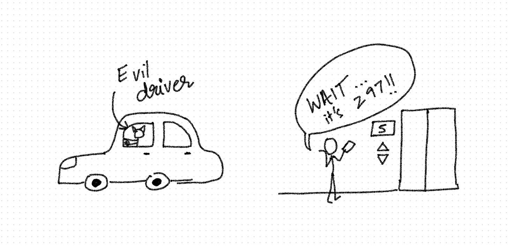
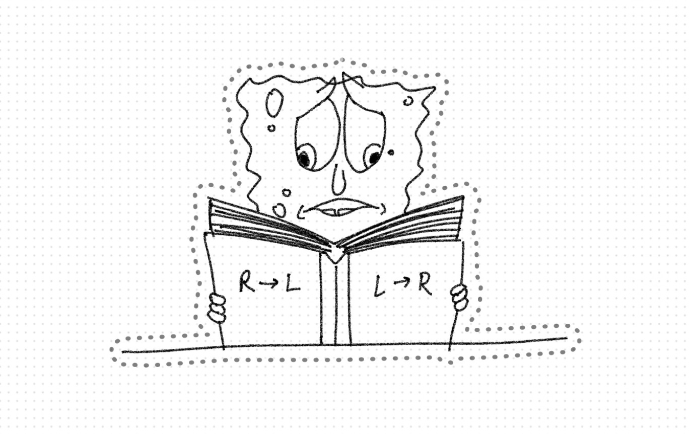

This is a new blog post series where I would be sharing some interesting random questions that pop-up in my head in that week. I’ll also be sharing a short answer with a fun doodle. It’ll be a quick read for anyone who is interested! 

 

Let’s get started! 

#### **1. Why do seller's market prices as 299 instead of 300?**  
This question popped in my brain when I got scammed by my Uber driver. I booked a ride for ₹297 and when it ended the driver said it shows ₹345 on his phone. I told him that it was somewhere in late 290s when I booked the cab but I didn’t reopen the app to check the history because final costs change when there’s traffic. I figured it’s only ₹50 extra and we drove through a lot of traffic in peak morning heat in middle of a heat-wave so I paid the amount he told me. When I reached the lift, I progressively got sadder because somehow ~₹350 sounds much more than what I booked the cab for! Was the difference ₹150 and I miscalculated? I opened Uber and saw it was indeed only ₹297. So yes I was scammed but it was for ₹50 and not ₹150. But why did my brain rounded down 297 to 200? Does “299 price” marketing trick actually work? 

 

Origin of nine-based pricing:  Back when cash registers weren't that advanced, this pricing trick was adopted to ensure cashiers don't pocket the whole amount (say $2) as they would have to return little amount back to the customer when it's priced $1.9. This would ensure cashiers open the cash register and since most people don’t pay in exact amounts in cents.  

**Left digit effect:** Most significant digit in a number is the left most digit which holds the highest value. When we see something priced ₹299 (or say ₹295), instead of ₹300, our brains see a lower number at the left side and perceives it as a cheaper price.  

In Daniel Kahneman’s book “Thinking Fast and Slow”, he theorizes that there are two systems in our brain - a conscious one and an automatic one. **Automatic system** process information really fast (and almost uncontrollably so) like reading facial expressions, picturing cute elephants when you’re asked _not_ to. Meanwhile, the other **Conscious System** is more deliberate which requires your attention and effort, like searching for a friend in a crowded place or recalling a familiar song from memory or- you guessed it- mathematical calculations. The second conscious system is famously lazy and would avoid effort if it can help it.   

So when we see something priced as 295, our automatic system sees the most significant digit as “2” and becomes happy because it’s perceived as a product in range of 200s. That is until our brain’s conscious system would roll it’s eyes and do the calculation, then ask us to register it as price of 300. 

This also applies for discounts and second-most significant digit, where 110 price would be marketed as 109 to give an illusion of price range of 100s. This is, of course, less effective in sales as compared to the drop in most significant digit.  

_Side tangent: The concept of “left digit effect” is similar to the concept of Most Significant Bit (MSB) in Computer Science. MSB is the left most bit which is stores/transmitted. It’s called “most significant bit” because it has greatest effect on the number. Some systems start with LSB (least significant bit) too which is the right most bit with least effect like unit place digits. And so comes two ways of storing bytes - **Little-endian**, which stores little bytes first (LSB → MSB), and **big-endian**which stores big bytes first (MSB → LSB)._  

Hold on, there’s one more effect at play here… 

**Odd-even pricing:** Odd pricing gives a perception of a **discounted price** and it feels like a more **honest pricing**, so odd numbers at the unit place are used to trick people into illusion of a “sale” when it’s displayed as 295 or 299. On the other hand, even pricing feel more **clean and premium** to our minds, so they’re used by luxury brands where prices end in 0s. But why, you ask? Simply because consumers have become conditioned to this.  

There is an [interesting YouTube video by Veritasium](https://www.youtube.com/watch?v=d6iQrh2TK98) that does a public experiment where people are asked to pick a random number between 1-100 and a _lot_ of people choose “37” and “"73” because it consists of two odd prime digits which psychologically _feels_most random.  

All of this probably explains why ~~Zara~~ [insert generic fast fashion brand] has prices ending like ₹2990 so they can take advantage of pseudo-premium even pricing and left digit effect. Fun! 

#### 2. Are numbers written left-to-right in languages which are read right-to-left? 
While I was google-ing about the above mentioned “left digit effect”, I wondered if that’ll still be effective in countries which read from right to left? But wait, how _do_ they write numbers in languages which are read right-to-left? 

 

The answer is interesting and yet simple: Numbers are written the same in right-to-left languages, they are just _read_ differently. So when reading left to right text, numbers are read in same flow which goes thousands-hundreds-tens-units, whereas reading right to left does the same so it’s read units-tens-hundreds-thousands. For example, 6543 is read as “three-forty-five-hundred-and-six-thousand” in languages which are read right-to-left.  

But wait… numbers are read starting from unit places in few left-to-right languages too, like Germany! For example, 25 is written as "fünfundzwanzig" in German which means “five and twenty”. And interestingly, 6543 is written as “sechstausendfünfhundertdreiundvierzig” which translates to “six thousand five hundred three and forty” (6000 + 500 + 3 + 40).  

So since we all write numbers the same way 6543 (regardless of any bizarre order we read them…), the most significant digit remains the left most. And so the left digit effect also works in languages which are read right-to-left. They might read it starting from unit places but the trick of “left digit effect” isn’t to decrease the number you first “read”, it’s the perception of the most significant digit which remains the same.  

References:  

- “[How to Master Odd-Even Pricing](https://www.buynomics.com/articles/odd-even-pricing#:~:text=Since%20consumers%20focus%20on%20the,no%20such%20statement%20being%20made.)” 

 
- “[Little endian and Big endian](http://www.cs.emory.edu/~cheung/Courses/255/Syllabus/7-ARM/endian.html)”  

 
- “[If Arabs read right-to-left, do they see "700" as "007"?](https://www.jitbit.com/alexblog/280-if-arabs-read-right-to-left-do-they-see-700-as-007/)**”** 

 

--- 
If you have more information about these topics, you’re welcome to share more facts or correct if I got something wrong.   

Thanks for reading this article - hope you found it interesting!  

