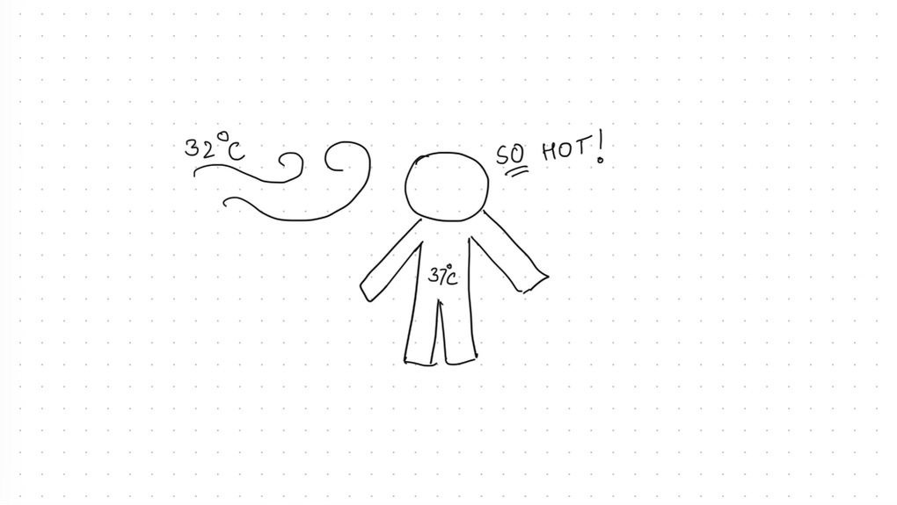

This is a blog post series where I would be sharing some interesting random questions that pop-up in my head in that week, with a short answer and a fun doodle. It’ll be a quick read for anyone who is interested! 

Let’s see what we have this week: 

#### 1. Why does 37 degree Celsius outside feels hot when it's also human’s normal body temperature?  
Fun fact: In India, we _usually_ measure air temperature in Celsius and body temperature in Fahrenheit - which is an _odd_ system but also somehow a smart one? In Celsius, 0 degrees is the freezing point of water and 100 degrees is the boiling point - good scale for air temperature. Whereas, 100 degree Fahrenheit is around the normal human temperature - good scale for body temperature.   

In middle of the head wave, a question popped in my mind - why does 32 degrees feel so hot when 37 degrees is the normal body temperature? Shouldn’t it feel _cooler_? 

 

So, 37 degrees Celsius is our internal **core temperature** and the temperature that's on our skin is actually lower than that! **Our arms and feet tend to be couple degrees cooler. And skin even more cooler (around ~32 degrees)**.  

Our body’s metabolic processes are exothermic processes (i.e. they release heat as a byproduct), so **our body is always looking for ways to get rid of excess heat**. Much like a computer, overheating makes humans non-functional/sick too.  

According to second law of thermodynamics, heat always flows spontaneously from hotter to colder regions of matter. So **at low air temperature (say 21 degrees), it’l be more easier for body (which is at 32 degrees on our skin) to get rid of the body heat**. The air molecules near our skin heat up and rise, leaving behind the cooler air molecules.  

When air temperature is near the body temperature, body tries few tricks to get rid of the access heat generated inside: 

1. Increase blood flow: Blood travels through blood vessels close to your skin. Blood consist of mostly water and water is a great conductor of heat because it absorbs a lot of heat before it’s temperature rises. So your **blood vessels under your skin get wider, which increases the blood flow, and it raises the temperature of your skin**. It tries to raise it above the air temperature, so heat can flow out from skin to air.  

 
2. Sweating: When the air temperature is high enough that the above trick doesn’t work, the body relies on principle of “heat of vaporization”. Excess **body heat is used to convert sweat into vapor**, and you start to cool down. Sadly, during humid conditions, water vapor in air slow down evaporation of sweat. This is why hot humid air is the _worst_. 

 
And so when air temperature is near the body temperature, it’s more difficult for body to lose all the body heat. Lack of temperature difference prevents heat transfer and so we feel hot - seems obvious enough now, doesn’t it?  

But this body heat also has it’s advantages - it also prevent bad bacterial and fungal growth (which is why a fever helps the immune system by making an uncomfortable environment for the pathogens). This body heat also allows us to survive in extreme cold conditions (we can regulate our body temperature and so don’t have to hibernate when it’s cold; _it’s just a lifestyle choice some of us opt into_). 

--- 
References: 

1. “[If Our Body Temperature Is 37 Degrees Celsius, Why Do We Feel Hot When It’s 37 Degrees Outside?](https://www.scienceabc.com/humans/if-the-body-temperature-is-37-degree-celsius-why-do-you-feel-hot-when-its-37-degrees-outside.html)” 

 
2. “[Why Does Body-Temperature Air Feel Hot?](https://www.youtube.com/watch?v=efg_gbzbyGk)**”** 

 

--- 
Thank you for reading! :) 

 