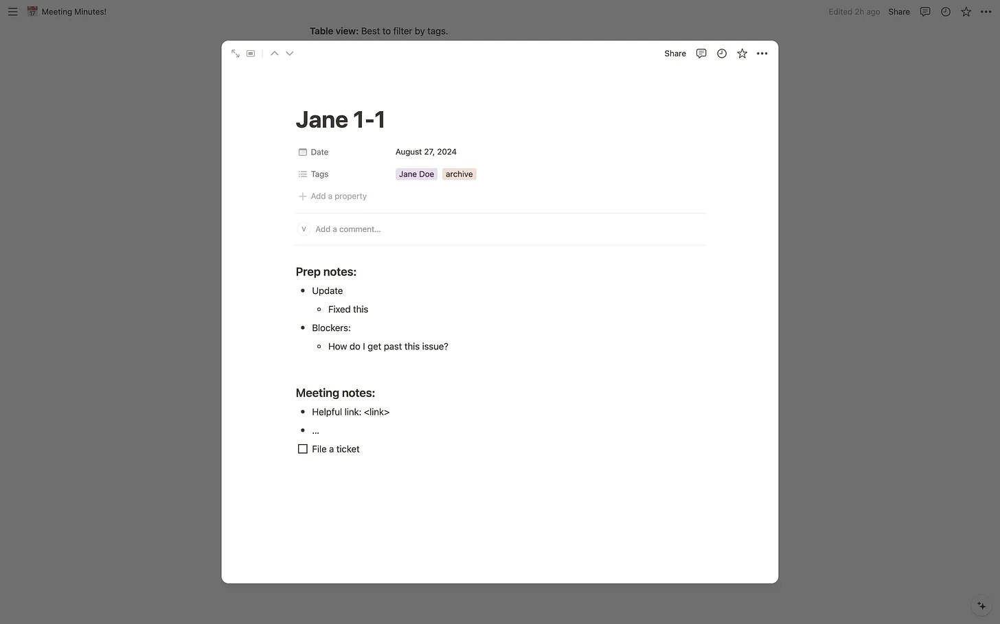
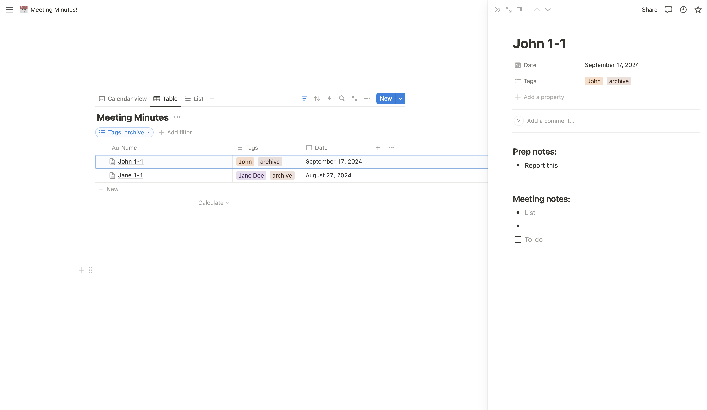
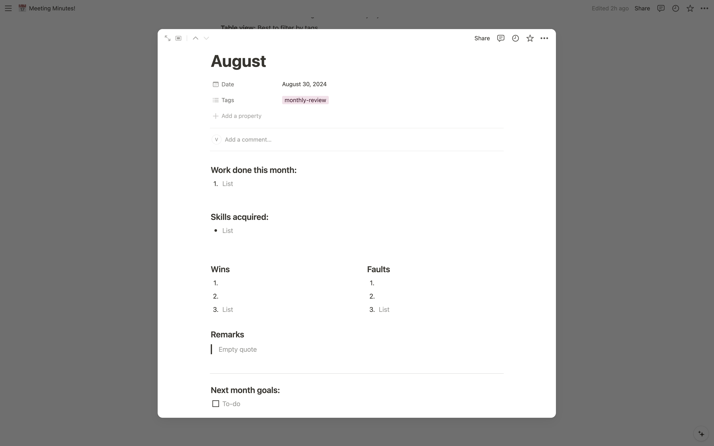

In this post, I’ll share a simple Notion template I made for tracking meeting notes.

**I’ve been using this template for almost 2 years now** and it’s been very effective for me, so I decided to publish it to share with everyone. I use this template for tracking notes for 1-1 meetings, team meetings, and monthly reviews.

Key requirements:

1. Calendar view 
2. Filter by attendee (team/person)
3. Easy to **find specific past notes**.
4. Stupid-simple! We want to **focus on writing**, not organisation. 

Let me give you a walkthrough and share how I use it.

# Workflow

Calendar view is great for viewing and adding notes. It’s pretty simple to add a new meeting note. **Select “Meeting Template” after adding a new note and that’s it!**

<!--  -->

I write everything I need for a meeting, including links and code or log snippets, to ensure I have full context. All this goes under “Prep notes” section.

I dump everything that’s discussed in the meeting, along with some potential action items, in the “Meeting notes” section. After this, I can choose to add them to my todo app.

### Quick search - using tags and views
I switch to "Table view" or "List view" to apply filters when searching for a note. This displays all notes in a single list, making it easier to view the filtered results.

**Tags can be used to filter by attending team or colleague names,** making it easier to find notes related to specific meeting attendees.

**Archive Tag**: I use an “archive” tag for notes with important details that I expect to revisit in a few months. This makes it easier to filter out regular meeting notes and focus on a shorter list of key information when needed.

<!--  -->

Notion allows to use more advanced filters if you’re interested in something more complex!

### Monthly Overview

It’s more convenient to have a self-reflection work dairy here because **everything you do at work is somewhere in this database**. It’s easy to go through your weekly updates with manager and use them to reflect your progress over a month.

## Try it yourself - it’s FREE!

I published this template on Notion template gallery so it’s easy for others to add it to their notion workspace. **Click “Get Template” in the link below and that’s it!**

**Template link:** [https://www.notion.so/templates/vallari-meeting-notes](https://www.notion.so/templates/vallari-meeting-notes)

