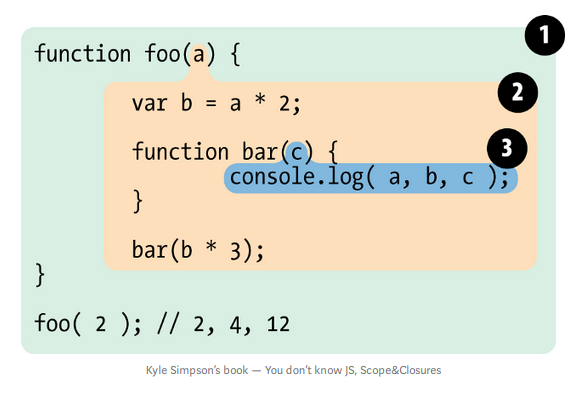

## Scope
> “Scope in Javascript is what a context is in English. Just like context gives meaning to a word, scope gives meaning to a variable/object. In technical terms, A scope is just a finite set of variables/objects that an execution context have access to”.

Let's start by understanding how JavaScript codes run.

**JavaScript is a compiled & interpreted language.**
It means that, in JavaScript, the code is complied and then executed right away.

JavaScript engine compiles JavaScript to optimized machine code before execution. It is responsible for start-to-finish compilation and execution. It is compiler's job to parse and generate code for Engine to execute later. And it's Scope job to collect and maintain a lookup of all variables defined, and their rules of accessibility.


Let's see how `var a = 2;` is compiled. Encountering `var a`, Compiler asks Scope about existance of a variable `a` in that particular Scope collection. Scope says it exists, compiler ignores `var a`. Scope says it doesn't exist, compiler creates a varible `a` in that scope collection. Compile produces code for Engine to execute later. Engine sees `a = 2` and asks Scope if `a` exists. Scope says yes, Engine assigns value to `a`. IF Scope said no, that no such variable was introduced by compiler, Engine asks Scope to look in it's nested loops.

So, there are two kinds of look-ups. One, that Compiler asks Scope to look/create a variable. Another, where Engine asks Scope to return value of variable.

These are usually, on either side of `=`, the *assignment operator*. The right hand side (RHS) is usually the look-up for Engine, and left hand side (LHS) is usually the look-up for Compiler. For example `var a = b + c`, compiler asks for a RHS look-up and makes the variable `a` (if it existed then it ignores it). After compilation, the Engine asks for a LHS look-up, Scope finds values of `b` and `c`, Engine adds the values and then assigns value to `a`. 

#### Looking in nested loops
```js
var b = 2;
function foo(c) {
    var a = b + c;
    console.log(a);
}
foo(3);
``` 
If Engine asks for value of `b` and `c` in line 3, Scope can't find a variable `b` in it's currect scope collection of function `foo` so it looks for it in it's parent scope (here that's global scope!) and keeps checking at nested scopes till it finds `b` or reaches the top level scope, the global scope.

###### Shadowing

*Scope lookups stops once it finds the first match*. So, if there was a variable `a` outside `foo()`, lookup will always return the first match, i.e. `a` defined inside `foo()`. Same identifier defined in multiple layer scope is called **shadowing**. So, inner identifier `a` shodows outter identifer `a`.
```js
var a = 2;
function foo() {
    var a = 5;
}
```
*How to access shadowed variables?* Global variables are automatically a property of global object (*window* in browsers etc.) so we can access global variables as `window.a` that would otherwise be inaccessible because of being shadowed. Non-global shadowed variables cannot be accessed. 
<!-- Compiler just helps Scope makes a schema for where the variables are defined.  -->
#### Errors
For `a = 2`, if there is no such variable definition before of `a` in all nested scopes, then compiler would spring a *ReferenceError*. But if Engine is looking for a variable `a` and doesn't find it in any of it's nested scope, then (if not in strict mode) a new variable of name `a` will be created in the *global scope* and is handed it to Engine. In strict mode, Engine would throw a *ReferenceError* as well.


### Lexical Scope
There are two predominant ways scopes works: *lexical scope*, and *dynamic scopes*. JavaScript employs lexical scope model.

Lexing or tokenization is a process that takes a string of code and converts it into tokens with a *stateful rules deciding if each token is distant or part of another token*. So lexical scope is scope defined at lexing time.

Lexical scope is *authored by us while writing* and thus are *set in stone* by the time lexer (tokenizer) processes your code.

Let’s explain how the lexical scope works with an example:


1. Global scope: *foo*
2. *foo* scope: *a, b, bar*
3. *bar* scope: *c*


#### Cheating Lexical Scope
Even though they are *set in stone* as they are scopes in which you write code, lexical scope can be cheated! Cheated? Yeah, we can not define a variable during writing the code (author-time) and define it after lexer has passed by. You might ask, add a variable to scope after author-time? Is that possible? Yes, it is!

There are two ways to cheat lexical scope, both of which are considered bad practices and should be avoided. Why? *Cheating lexical scope leads to poorer performance*. Now, let's look at these two ways:
1. `eval`
    > The eval() function evaluates JavaScript code represented as a string.

```js
function foo(str, a) {
    eval(str); //cheating!
    console.log(str, a);
} 

var b = 2;

foo("var b = 3;", 1);
```
So, at line 2, it will execute `var b = 3;`. Instead of authoring `b` in `foo` at author-time, it will dynamically modify the lexical scope environment. The Engine will not care if `b` was added after lexing, it will execute it, and print `1 3` on console, as dynamically added `b` will shadow the gobal `b`. 

In strict mode, `eval()` has it's own scope, i.e. declarations inside `eval` do not modify the enclosing scope. So, the output of line 3 will be `1 2`. 

2. with
 > The with statement extends the scope chain for a statement.
`with` is explained as multiple property references against an object *without* repeating the object reference itself each time.

`with` is not allowed in scrict-mode.
```js
var obj = {
    a: 1,
    b: 2,
    c: 3
};

// repeating
obj.a = 100
obj.b = 200
obj.c = 300

// "easier" short-hand
with (obj) {
    a = 100;
    b = 200;
    c = 300;
}
```
So, with `with` (winks*) 
But there is much more going on than just a convenient shorthand. Look at this:

```js
function foo(obj) {
    with (obj) {
        a = 2;
    }
}

var o1 = {
    a: 3
};

var o2 = {
    b: 3
};

foo(o1);
console.log(o1.a); // 2 -- expected

foo(o2);
console.log(o2.a); //undefined
console.log(a); // 2 -- Leaked global!
```
When we pass `o2`, which does not porssess property `a`, no such property is created in `with` and `o2.a` remains undefined.
Also, a golabl variable `a` is created by the `a = 2` assignment.

The `with` statement takes an object, and treats that object as a wholly seperate lexical scope. Thus, object's properties are lexical defined in that scope. A normal var declaration inside that `with` block will be scoped to it's containing function scope.

So, the scope declared by `with` statement to `o1` was `o1` scope, and it accessed it's property `o1.a`. But when we used  `o2` as a scope, it has no property `a` defined in that scope so LHS identifier lookup occured (remember how it creates a new variable at global scope when the variable is not found in all it's nested scopes, in non-strict mode).

`eval()` modified the lexical scope, but `with` creates a whole new lexicals scope from the object you pass to it.


##### Performace

The engine performs a number of performance optimisation during compilation phase. Some of which boils down to, analysing the code as it lexes and pre-determine where all variables and function declarations are, so that it takes less effort to resolve identifiers during execution.

But with presence of `eval` or `with`, it canot know at lexing time what code `eval` has that modifies the scope or what new scope `with` will create, so it essentially assumes that most of optimisations it would make are pointless due to ambiguity in scopes so it doesn't perform the optimisation *at all*. Hence, making the execution slower. 

### Function VS Block Scope

JavaScipt has function-based scope. Each function has it's own scope.
```js
function foo(a) {
    var b;
    function bar() {  
        // code 
    }
    var c;
}
```
There exists global scope with `foo()` identifier. 
Scope of `foo()` includes identifiers `a`, `b`, `c`, and `bar`. Also, `bar` has it's own scope. All these identifiers (`a`, `b`, `c`) are accessible inside `foo()` and inside `bar()` (assuming no shadow identifier is declared inside `bar`).


Why use functions? Discussing with scopes in mind with functions you can "hide" variables and functions by enclosing them in a scope of a function. Why do we do that? 
- Because of a software design principle called *Principle of Least Privilege* (or Least Authority or Least Exposure), which says that you should expose oly what is minimally necessary and "hide"  everything else (i.e. abstraction).
- Collision Avoidance: To avoid unintended collision between two different identifers with same name, made for different usages.


## Hoisting

## Scope Closure


## References

- [You don't know JS: Scope & Closures](https://github.com/getify/You-Dont-Know-JS/blob/1st-ed/scope%20&%20closures/README.md#you-dont-know-js-scope--closures)
- [Javascript Scope Chain and Execution Context simplified](https://medium.com/koderlabs/javascript-scope-chain-and-execution-context-simplified-ffb54fc6ad02)
- https://medium.com/@osmanakar_65575/javascript-lexical-and-dynamic-scoping-72c17e4476dd
