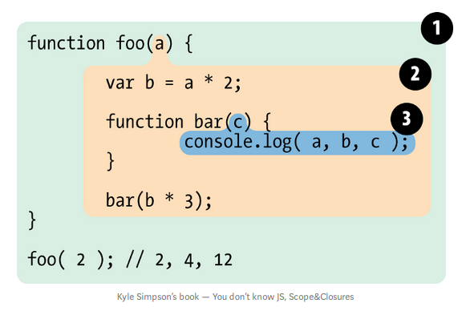

## Scope
> “Scope in Javascript is what a context is in English. Just like context gives meaning to a word, scope gives meaning to a variable/object. In technical terms, A scope is just a finite set of variables/objects that an execution context have access to”.

Let's start by understanding how JavaScript codes run.

**JavaScript is a compiled & interpreted language.**
It means that, in JavaScript, the code is compiled and then executed right away.

JavaScript engine compiles JavaScript to optimized machine code before execution. It is responsible for start-to-finish compilation and execution. It is compiler's job to parse and generate code for Engine to execute later. And it's Scope job to collect and maintain a lookup of all variables defined, and their rules of accessibility.


Let's see how `var a = 2;` is compiled. Encountering `var a`, Compiler asks Scope about existence of a variable `a` in that particular Scope collection. If Scope says it exists, the compiler ignores `var a` (i.e. initializing a variable). Otherwise, if Scope says it doesn't exist, the compiler creates a variable `a` in that scope collection. Then Compiler produces code for Engine to execute later. Engine sees `a = 2` and asks Scope if `a` exists. Scope says yes, Engine assigns value `2` to `a`. If* Scope said no, that no such variable was introduced by compiler, Engine asks Scope to look in its enclosing area (see this in nested loop).

So, there are two kinds of look-ups. One, that Compiler asks Scope to look/create a variable. Another, where Engine asks Scope to return value of variable.

These are usually, on either side of `=`, the *assignment operator*. The right hand side (RHS) is usually the look-up for Engine to asking for variable's values, and left hand side (LHS) is usually the look-up for Compiler to create variables. For example `var a = b + c`, compiler asks for a RHS look-up and makes the variable `a` (if it existed then it ignores it). After compilation, the Engine asks for a LHS look-up, Scope finds values of `b` and `c`, Engine adds the values and then assigns value to `a`. 

### Nested loops
```js
var b = 2;
function foo(c) {
    var a = b + c;
    console.log(a);
}
foo(3);
``` 
If Engine asks for value of `b` and `c` in line 3, Scope can't find a variable `b` in it's currect scope collection of function `foo` so it looks for it in it's enclosing scope (that's global scope, here!) and keeps checking at nested scopes till it finds `b` or reaches the top level scope, the global scope.

#### Shadowing

*Scope lookups stops once it finds the first match*. So, if there was a variable `a` outside `foo()`, lookup will always return the first match, i.e. `a` defined inside `foo()`. Same identifier defined in multiple layer scope is called **shadowing**. So, inner identifier `a` shodows outer identifer `a`.
```js
var a = 2;
function foo() {
    var a = 5;
}
```
*How to access shadowed variables?*  Global variables are automatically a property of global object (*window* in browsers etc.) so we can access global variables as `window.a` that would otherwise be inaccessible because of being shadowed. Non-global shadowed variables cannot be accessed. 
<!-- Compiler just helps Scope makes a schema for where the variables are defined.  -->
### Errors
For `a = 2`, if there is no such variable definition before of `a` in all nested scopes, then compiler would spring a *ReferenceError*. But if Engine is looking for a variable `a` and doesn't find it in any of it's nested scope, then (if not in strict mode) a new variable of name `a` will be created in the *global scope* and is handed it to Engine. In strict mode, Engine would throw a *ReferenceError* as well.


## Lexical Scope

Lexing or tokenization is a process (first step of compilation) that takes a string of code and converts it into tokens with *stateful rules deciding if each token is distant or part of another token*. So lexical scope is scope defined at lexing time (which depends on how you authored the code).

Lexical scope is *authored by us while writing* and thus are *set in stone* by the time lexer (tokenizer) processes your code.

There are two predominant ways scopes works: *lexical scope*, and *dynamic scopes*. *JavaScript employs lexical scope model*. Let's have a quick look at some differences between them to understand scopes better: 

- Lexical scope is write-time, whereas dynamic scope are runtime. 
- Lexical scope cares **where a function was declared** but dynamic code cares **where a function is called**.

Now, let’s see how the lexical scope works with an example:



Dividing code in blocks specifies what variables or identifers are "seen" in each block. In this example, let's see what identifiers are in within which scopes:

1. Global scope: *foo*
2. *foo* scope: *a, b, bar*
3. *bar* scope: *c*


#### Cheating Lexical Scope
Even though they are *set in stone* as they are scopes in which you write code, lexical scope can be cheated! Cheated? Yeah, we can not define a variable during writing the code (author-time) and define it after lexer has passed by. You might ask, add a variable to scope after author-time? Is that even possible? Yes, it is!

There are two ways to cheat lexical scope, both of which are considered bad practices and should be avoided. Why? *Cheating lexical scope leads to poorer performance* (we'll look at this later). Now, let's look at these two ways:
1. `eval`
    > The eval() function evaluates JavaScript code represented as a string.

```js
function foo(str, a) {
    eval(str); //cheating!
    console.log(str, a);
} 

var b = 2;

foo("var b = 3;", 1);
```
So, at line 2, `var b = 3;` will be executed. Instead of authoring `b` inside `foo` at author-time, it will dynamically modify the lexical scope environment. The Engine will not care if `b` was added after lexing, it will execute it, and print `1 3` on console, as dynamically added `b` will shadow the global `b`. 

In strict mode, `eval()` has it's own scope, i.e. declarations inside `eval` do not modify the enclosing scope. So, the output of line 3 will be `1 2`. 

2. with
 > The with statement extends the scope chain for a statement.
`with` is explained as multiple property references against an object *without* repeating the object reference itself each time.

`with` is not allowed in strict-mode.
```js
var obj = {
    a: 1,
    b: 2,
    c: 3
};

// repeating
obj.a = 100
obj.b = 200
obj.c = 300

// "easier" short-hand
with (obj) {
    a = 100;
    b = 200;
    c = 300;
}
```
So, with `with` (winks*) 
But there is much more going on than just a convenient shorthand. Look at this:

```js
function foo(obj) {
    with (obj) {
        a = 2;
    }
}

var obj1 = {
    a: 3
};

var obj2 = {
    b: 3
};

foo(obj1);
console.log(obj1.a); // 2 -- expected

foo(obj2);
console.log(obj2.a); //undefined
console.log(a); // 2 -- Leaked global!
```
When we pass `obj2`, which does not porssess property `a`, no such property is created in `with` and `obj2.a` remains undefined.
Also, a global variable `a` is created by the `a = 2` assignment.

The `with` statement takes an object and treats that object as a wholly separate lexical scope. Thus, the object's properties are lexically defined in that scope. A normal var declaration inside that `with` block will be scoped to it's containing function scope.

So, the scope declared by `with` statement to `obj1` was `obj1` scope, and it accessed it's property `obj1.a`. But when we used  `obj2` as a scope, it has no property `a` defined in that scope so LHS identifier lookup occurred (remember how it creates a new variable at global scope when the variable is not found in all it's nested scopes, in non-strict mode).

`eval()` modified the lexical scope, but `with` creates a whole new lexical scope from the object you pass to it.


##### Performace

The engine performs a number of performance optimization during the compilation phase. Some of which boils down to, analyzing the code as it lexes and pre-determine where all variables and function declarations are so that it takes less effort to resolve identifiers during execution.

But with the presence of `eval` or `with`, it can't know at lexing time what code `eval` has that modifies the scope or what new scope `with` will create, so it essentially assumes that most of the optimisations it would make are pointless due to ambiguity in scopes so it doesn't perform the optimization *at all**. Hence, making the execution slower.

## Function VS Block Scope

JavaScript has function-based scope. Each function has it's own scope.
```js
function foo(a) {
    var b;
    function bar() {  
        // code 
    }
    var c;
}
```
There exists global scope with `foo()` identifier. 
Scope of `foo()` includes identifiers `a`, `b`, `c`, and `bar`. Also, `bar` has it's own scope. All these identifiers (`a`, `b`, `c`) are accessible inside `foo()` and inside `bar()` (assuming no shadow identifier is declared inside `bar`).

Let's see functions like taking a snippet of code and wrapping it into a bubble (viz function).

Why use functions? Discussing with scopes in mind, with functions you can "hide" variables and functions by enclosing them in a scope of a function. Why do we do that? 
- Because of a software design principle called *Principle of Least Privilege* (or Least Authority or Least Exposure), which says that you should expose only what is minimally necessary and "hide"  everything else (i.e. abstraction).
- Collision Avoidance: To avoid unintended collision between two different identifiers with same name, made for different usages. Other ways to avoid collision are:
    
    - Global namespaces:  Multiple libraries can have identifiers that collide with each other so such libraries, typically, will create a single unique variable declaration (like an object) and use it as *namespace* for that library, where all functionalities are properties of that object.
        ```js
        var libary1 = {
            name: "libary1",
            doSomething: function () { ... },
            doSomethingElse: function () { ... }
        }
        ```
    - Module management: Using modern *module* approach, using dependency managers. With these tools, no library ever adds identifier to global scope but instead have their identifiers be explicitly imported into a specific scope.

#### Functions as Scopes 

```js
var b = 3;
function foo() {
    var b = 2;
    console.log(b); //2
} 
foo();
console.log(b); //3
```

Here, `foo()` pollutes the enclosing scope (here it's global scope)

```js
var b = 3;
(function foo() {
    var b = 2;
    console.log(b); //2
})();
console.log(b); //3
```
Here, enclosing function in () makes it expression. `function foo() {..}` is a *function declaration*, while `(function foo() {..})` is a *function expression*, and adding another `()` after `(function)` executes it. These functions are called **IIFE (Immediately Invoked function expression)**  

In the first code snippet, `foo` is bound in enclosing scope (here global), while in the second code snippet `foo` is not bound to enclosing scope but *only* bound to inside its own function. 

Hence, making `foo` a function expressions doesn't pollute the enclosing scope!

Another application of IIFE can be that default `undefined` identifier can have it's value incorrectly overwritten, so by naming a parameter undefined and not passing any value for that argument, we can guarantee that `undefined` is `undefined`.

```js
undefined = true;

(function foo(undefined){
    var a;
    if (a === undefined) {
        console.log("undefined is safe here!");
    }
})();
```
Another variant of IIFE would be to declare the function definition in IIFE parameter and pass it as an argument to invoke.
```js
var a = 2;

(function foo(def){
    def(window)
})(function def(global){
    var a = 3;
    console.log(a); //3
    console.log(global.a); //2
})
```

**Named Functions > Anonymous Functions**

Anonymous functions are when `function()` has no identifier attached to it. These are most commonly used with `setTimeout()` like:
```js
setTimeout(function () {
    console.log("I waited 1 second!")
}, 1000);
```
It is always better to use named functions because:
-  There is no useful name to display on stack traces, which makes debugging difficult.
-  For a function to refer to itself (i.e. for recursion) we would have to use *deprecated* `arguments.callee` reference.
-  Named functions are more readable as a descriptive name helps self-document the code

#### Blocks as scope
A block is a snippet of code that's usually wrapped in brackets `{ .. }`.

Block scope is a tool to extend the *Principle of Least Privilege* from hiding information in functions to hiding information in blocks of code.
It's also helpful that we don't have to *check* accidental reuse of a variable outside it's intended scope.


1. var

A common example of block scope is a `for` loop.
```js
for (var i = 0; i < 10; i++){
    console.log(i)
}
console.log(i) //10
```
We would want `i` to only exist in the `for` block (as it's only used there) so it doesn't pollute the enclosing scope.

However, `var` always belongs to the enclosing scope, so this `for` loop is essentially fake block-scoping.

2. let

ES6 introduced `let` so we can actually bind variables in block scope instead of faking it as `var` does.

```js
var foo = true;

if(foo) {
    let bar = foo * 2;
    bar = something(bar);
    console.log(bar); 
}

console.log(bar); //ReferenceError
```
`let` allows a way to explicitly define  blocks.
The identifiers exists only in it's scope, i.e. their code block.


##### `let` rebinds variables in each iteration

Here, not only `let` binds `i` to for loop body but in fact, it *rebinds* it to each iteration of the loop, after reassigning its value from previous loop iteration. It's equivalent to this:

```js
{
    let j;
    for(j = 0; j<10; j++){
        let i = j; //re-bound at each iteration!
        console.log(i);
    }
}
```

Also, `let` will not hoist the variable to entire scope of the block they appear in. They don't observably "exist" until the declaration statement. Observe this:
```js
{
    console.log(bar); //ReferenceError
    let bar = 2;
}
```

3. const

Introduced by ES6, `const` also creates block scoped variables, but whose values are fixed. Any attempt to change it's value at a later time will result in an error.
```js
{
    const a = 2;
    var b = 3;
    
    b = 30; 
    a = 20; //error 
}
```

- catch:

    The variable declaration in `catch` of a `try/catch` is block scoped to `catch` block.
    ```js
    try {
        // something that failed
    } catch (err) {
        console.log(err); // works!
    }

    console.log(err); // ReferenceError: 'err' not found
    ```


## Hoisting

Let's look back to our JavaScript Engine. The engine compiles before it executes. Part of the compilation was to find and associate all declarations with their respective scopes (lexical scoping).

So, looking back at `var a = 2;`, JavaScript thinks of this as two statements. First statement, the declaration, is processed during compiling and the second statement, the assignment, is left *in place* for execution time.
```js
// var a = 2; is seen as
var a;
a = 2; 
```
Remembering declaration comes before execution, we can guess what the result of these snippets be:
```js
a = 2;
var a = 2;
console.log(a);
```
```js
console.log(a);
var a = 2;
```
The first snippet will output `2`. *How?* It will evaluate `var a` (declaration during compiling) then `a = 2` *then* `console.log(a)`.

Second snippet will output `undefined`. *How?* It will evaluate `var a` (declaration) then `console.log(a)` and then `a = 2`. See the assignment was *in place*, i.e. *after* logging it to console. 

The best way to think of this is that variable and functions are *moved* from where they appear in the flow of the code to top of the block. This is known as **hoisting**.

#### Functions

```js
foo();

function foo(){
    console.log(a); // undefined
    var a = 2;
}
```
During compiling `foo` function definition was hoisted to above function call `foo()` and so it's able to execute with no errors! (Also, inside the function you see `a` getting hoisted at top of it's block)

Function declarations are hoisted, but function expressions are not.

```js
foo(); //TypeError 
bar(); //ReferenceError

var foo = function bar(){
    // code
}
```
Here, during compilation `var foo` will be evaluated then during execution first `foo();` will be executed which does not have a value, so far, hence the value of `foo` at this time is `undefined`. Hence, you see a `TypeError` rather than a `ReferenceError`. For `bar()`, it doesn't know `bar` exists so far because the RHS of `foo` hasn't been evaluated yet, so it spits out a `ReferenceError`.

#### Functions First

When both function and variable declarations are hoisted, functions are hoisted first then variables.
```js
foo(); // 1

var foo;

function foo() {
    console.log(1);
}

foo = function() {
    console.log(2)
}
``` 
This is interpreted by Engine as:
```js
function foo() {
    console.log(1);
}
// var foo is ignored
foo();

foo = function() {
    console.log(2);
}
```
`var foo` was duplicate definition so it was ignored, *even though it came before the function* because function declarations are hoisted before normal variables.

What if there were two function definition (of same name) hoisted? If there had been a duplicate function definition, it would have overridden the previous function definition.

## Closure

> Closure is when a function is able to remember and access its lexical scope even when that function is executing outside its lexical scope.

```js
function foo() {
    var a = 2;

    function bar() {
        console.log(a);
    }
    return bar;
} 

var baz = foo();

baz(); // 2 HOW?
```
*`bar()` has lexical cope access to inner scope of `foo()`*. When, we execute `foo()`, we assign the value it returned (inner function `bar`) to variable `baz`. Now, `baz` is just another reference to inner function `bar` so when we call `baz();` it invokes `bar`.

After `foo()` is executed, engine employs a garbage collector to free up memory and since after `foo()` executed it would throw away entire inner scope of `foo`. This would happend normally if it wasn't for closure. But `bar` still has reference to the scope of `foo` (as it printed 2 instead of `RefernenceError`), and that reference is called closure.

When function is being invoked well outside of it's author time lexical scope, closure lets the function continue access to the lexical scope it was defined in author-time. 

*Wherever and whenever* functions are passed around as values, and invoked in other location, is exercising/observing closure. Be it timers, event handlers, or any asynchronous task, when you pass in a *callback function*, closures are involved.


Explained simply, whenever we *transport* an inner function outside of its lexical scope, it will maintain a scope reference to where it was originally declared, and wherever we execute him, that closure will be exercised.

Let's look at a `setTimeout` example:
```js
function wait(msg) {
    setTimeout(function timer(){
        console.log(msg);
    }, 1000);
}

wait("Hi");
```
1000ms after executing `wait("hi")`, the inner scope of `wait` would *otherwise* be long gone but `timer` has a scope closure over `wait` keeping and using reference of variable `msg`.

##### Does IIFE use closure?

```js
var a = 2;
(function IIFE(){
    console.log(a);
})();
```
This code does NOT exercise closure. Why? Even though IIFE make their own scope, and it's using a variable `a` of it's enclosing scope but because it's called/executed in it's enclosing scope it's not closure.

#### Loops and closure

```js
for (var i = 1; i <= 5; i++){
    setTimeout(function timer(){
        console.log(i);
    }, i * 1000);
}
```
This code outputs `6` five times. *How?* The loop stops when `i <= 5`, which will be first true when `i = 6`. So, all `timers` run after the completion of the loop (even `setTimeout(.., 0)`).

Why *didn't* each setTimeout captures it's own copy of `i` (making result `1 2 3 4 5`)? Though each `setTimeout` is defined separately in each loop iteration, they are closed over the same shared scope, which has only one `i`. Think of its equivalent using `setTimeout` *without loop* and incrementing a variable 5 times.

Let's understand this more by changing the loop to print `1 2 3 4 5`.

```js
for(var i = 1; i <=5; i++){
    (function IIFE(j) {
        setTimeout(function timer() {
            console.log(j)
        }, j*1000);
    })(i);
}
```
The use of IIFE inside each iteration created a new scope for each iteration, so `timer` closures over it's enclosing scope (i.e. `IIFE` function), where the value of each `i` is passed as a parameter.

But hold on, there is another way to get this output: use `let`!
```js
for (let i = 1; i <= 5; i++){
    setTimeout(function timer(){
        console.log(i);
    }, i * 1000);
}
```
`let` allows us to block scope this `for` loop. But as we [learned earlier](#let-rebinds-variables-in-each-iteration), `let` doesn't just declare variable in loop *once*, but for *each iteration*.

#### Modules

Modules are another code pattern that leverage the power of closures.

```js
function ModuleExample(id) {
    var another = [1, 2, 3];
    function printID() {
        console.log(id);
    }
    function doAnother() {
        console.log(another.join(" ! "))
    }
    
    return {
        doSomehing: doSomething,
        doAnother: doAnother
    } 
}

var foo = ModuleExample("one");
var foo2 = ModuleExample("two");

foo.printID() // "one"
foo.doAnother(); //1 ! 2 ! 3

foo2.printID() // "two"
foo2.doAnother(); //1 ! 2 ! 3
```
This pattern in JavaScript is called *module*. 

`ModuleExample` is just a function but has to be invoked for there to be a module instance created. It returns an object which references to inner functions but *not* data variables. Think of the object return value as *public API for our module*.

Stating simply, there are 2 requirements for the module pattern to be exercised:
- An outer enclosing function should exist, and it must be invoked at least once (each time creates a new module instance)
- The enclosing function must return back at least function, so its inner function has closure over private scope and can access to modify private state. 

(Cool tip: Inside the enclosing module function, you can name the returning object `let obj = { func: func };  return obj;` so you can change the returning functions dynamically)

ES6 treats a file as a separate module.

```js
// bar.js
function hello(who) {
    return "Hello, " + who;
}
export hello;
```
```js
// foo.js
import hello from "bar";

function awesome() {
    let wish = hello("human")
    console.log(wish); // Hello, human
}
```
 The contents inside a module file are treated as if enclosed in a scope closure, just like function-closure modules we just saw.

This article was written while reading "You don't know JS: Scope & Closures". To get a better understanding of the topics discussed with more examples, I suggest to read the book.
## References

- [You don't know JS: Scope & Closures](https://github.com/getify/You-Dont-Know-JS/blob/1st-ed/scope%20&%20closures/README.md#you-dont-know-js-scope--closures)
- [Javascript Scope Chain and Execution Context simplified](https://medium.com/koderlabs/javascript-scope-chain-and-execution-context-simplified-ffb54fc6ad02)
- [Lexical and dynamic scoping](https://medium.com/@osmanakar_65575/javascript-lexical-and-dynamic-scoping-72c17e4476dd)
