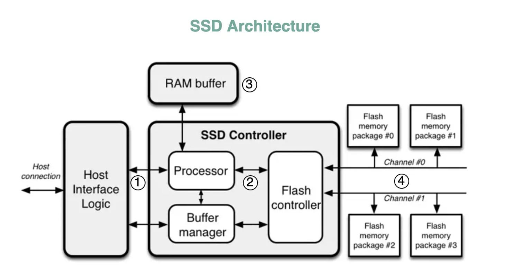
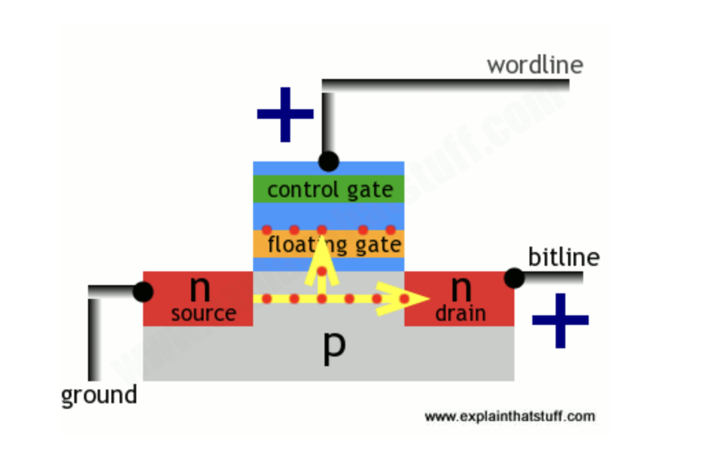
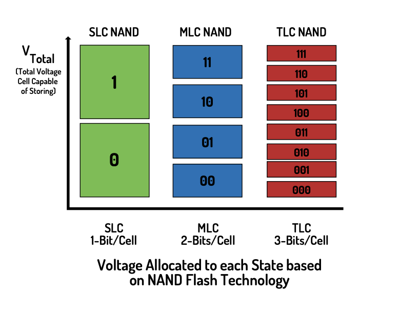
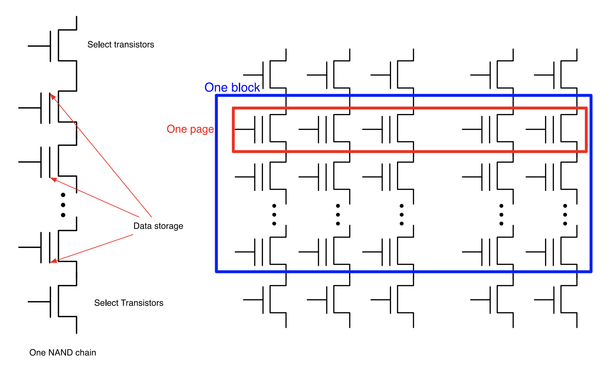
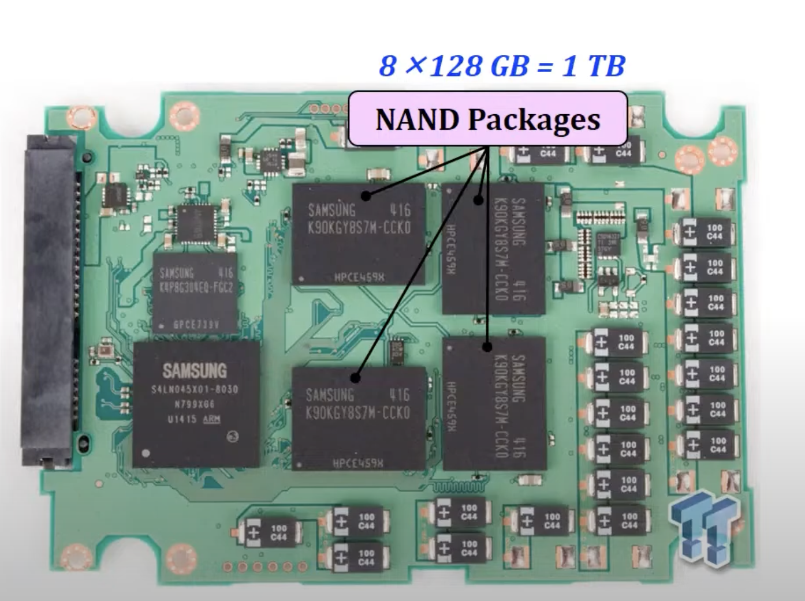

# SSD Architecture

(picture credit: [https://blog.bytebytego.com/p/why-is-a-solid-state-drive-ssd-fast](https://blog.bytebytego.com/p/why-is-a-solid-state-drive-ssd-fast))

In this blog, I'll be covering about SSD Controller and the Flash Storage. In the upcoming next article, we'll learn about host interfaces and DRAM. 

<!-- TODO: NAND vs NOR flash storage - brief  -->

## 1. NAND flash memory

Flash memory is non-volatile memory - which means that data is retained in the device even when it’s powered off. We also call this “persistent storage” or “permanent storage”. 

Every bit (set to either 0 or 1 state) is stored in a single flash cell - the smallest building block. A flash cell is made of a floating gate transistor (FGT). These transistors have a similar structure as MOSFET transistors, except FGT has two gates (control and floating gate) instead of one gate (control gate) of MOSFET. The floating gate on FGT is sandwiched with two layers of insulating oxide.

(picture credit: [https://www.explainthatstuff.com/flashmemory.html](https://www.explainthatstuff.com/flashmemory.html))

In MOSFET, source and drain are made of n-type silicon and between them is a p-type silicon substrate. When power (positive voltage) is applied to the control gate, electricity flows from source to drain, and the transistor is said to store one. When no electricity is flowing from source to drain, the transistor stores a zero. But when the power is turned off and then turned back on again - it’s unable to determine the previous state of the transistor before it was powered off. This makes the memory volatile. 

The floating gate flash transistor is different because the additional floating gate has the ability to store electrons/charge even when the power is turned off. Inner-working: when a positive voltage is supplied to control gate (wordline) and the drain (bitline), electrons flow from the source to the drain. Few electrons manage to cross the insulating oxide layer by a process known as “tunnelling”. These electrons can stay at the floating gate for infinite period of time, even when power is removed.

Reading data from cells: So when the floating gate is storing some charge and then electricity is passed through the transistor, the stored charge on floating gate stops the electricity from flowing and hence the FG transistor stores a zero. When no charge is stored in the floating gate and then electricity is passed through the transistor, the electricity is able to flow through the transistor and hence storing a one.

Floating gate has some charge → referred as “programmed” → binary 0

Floating gate has no charge → referred as “eased” → binary 1

Erase data on cells: Electrons stored on the floated gate are flushed out by supplying a negative voltage on control gate (wordline). This makes the electrons move from floating gate to p-type substrate. This clears the floating gate and electricity can flow through transistor again.  

End of life of a cell: The process of tunnelling wears down the oxide insulating layer, which makes the floating gate unable to store chargers on it. That’s why only finite number of reads/writes are possible each cell.

Types of NAND flash cells:

(picture credit: [https://www.cactus-tech.com/wp-content/uploads/2019/04/Solid-State-Drives-101-EBook.pdf](https://www.cactus-tech.com/wp-content/uploads/2019/04/Solid-State-Drives-101-EBook.pdf))

1. SLC (Single Level Cell) NAND cell - It is the transistor described above. It stores 1 bit per transistor and has 2 possible states. 
2. MLC (Multi Level Cell) NAND - It stores 2 bits and has 4 possible states. The distinction between 4 states depends on the amount of charge stored on the floating gate. 
3. TLC (Triple Level Cell) NAND - It stores 3 bits per transistor and has 8 possible states.

SLCs have bigger voltage guard band between it’s state compared to MLC and TLC. This makes SLCs able to withstand extreme temperatures compared to others. SLCs also have higher write speeds and hence they’re used as high-performing professional storage. MLCs and TCLs type flash are cheaper because more information can be stored in a single transistor, hence they’re common for usual storage use-cases.

**Blocks and Pages**

(picture credit: [https://cseweb.ucsd.edu/classes/sp14/cse240A-a/Slides/20_Storage.pdf](https://cseweb.ucsd.edu/classes/sp14/cse240A-a/Slides/20_Storage.pdf))

<!-- TODO: explain why reads and writes are page level. and erase are block level. -->

## 2. SSD controller

#### **2.1 Program/Erase Cycles - Read Pages and Erase Blocks**

(picture credits: [https://www.youtube.com/watch?v=4VTwOMmsnJY](https://www.youtube.com/watch?v=4VTwOMmsnJY))

A **package** is the flash memory chip. Each package contains many **dies** - smallest component which can independently execute commands (like read/write/update/erase). Each die contains many **planes**. And each plane contains many **blocks** - the smallest unit which can be erased. Each block can contains many **pages** - smallest unit that can be written. Each page is made of bunch of flash cells. (For perspective, a page is around 4KBs and if a block contains 128 pages then a block is 512 KBs. The side depends on the model.)

Reads: A page is the smallest unit that can be read. Even if part of the page data is requested, entire page would be retrieved.

Writes: Writing data to memory chips is called a **program** operation. These write/program operations happen on page level. Even if only 1 byte is to be written, a whole page (which could be upto few KBs, depends on the SSD model) would be written/programmed. This concept of writing more data than necessary is known as **write amplification**. So writes should be aligned to multiples of page size and writes below the page size should be avoided. To do this, small writes can be collected as buffers in RAM and written to pages in batches. 

(image credits: [https://flashdba.com/2014/09/17/understanding-flash-the-flash-translation-layer/](https://flashdba.com/2014/09/17/understanding-flash-the-flash-translation-layer/))

Updates: A part of data on a page cannot be overwritten because writes happen on a page level. So to make changes to a page, the current page’s content is copied to an internal register and then the data is updated there. Then the updated data is written to an empty page. The old page is marked as “stale” until it is erased. Flash translation layer is responsible for pointing to a new empty page, and to track the stale pages so they can be erased.  

Erases: A block is the smallest unit that can be erased. As the drive fills up, erase operation is triggered by the SSD controller’s **garbage collection** process to erase the pages marked as “stale”. The valid non-stale pages are copied to another block, leaving behind only stale pages in the old block. Then the whole block is erased, making it ready for future writes. Blocks can be erased a limited number of times because of wear-and-tear so they become unusable. And it takes much longer to do an erase operation compared to read and program/write operation, so erasing is necessary to be managed correctly to maintain performance.

The above process of writing on a page and then erasing a block and rewriting on a page is known as **program erase cycles** (P/E cycles).  

Queues: Only one command can be executed to a die at a time - other incoming commands are queued. So if want to do different operations on different blocks within the same die, then even those operations would be queued. 

#### **2.2 Flash translation layer**

It is a component inside the SSD Controller which hides the inner characteristics of NAND flash and exposes only an array of Logical Block Addresses (LBA) to the host. It’s two main purpose’s are: logical block mapping, wear levelling, and garbage collection.

**1. Logical block mapping**:

The logical block mapping keeps a table which translates logical block addresses (LBAs) from the host space into physical block addresses (PBAs) in the physical NAND-flash memory space. This table is stored in RAM for fast access and also saved in persistent flash memory in case of power failure. When SSD is powered on, the mapping table is read from persistent memory and reconstructed in RAM of the SSD. 

Why do we need it? When data is updated and a page is marked stale and updated-data is moved to a new page, the logical block address can be remapped from old page’s address to the new page’s address. Applications and software don’t need to be notified on every change to data’s physical address. Logical mapping makes the data seem sequentially stored (according to the applications) even though they’re physically stored in a distributed way across the blocks.

**Page-level mapping** consists of mapping of each logical page to physical. But it take a lot of space because the page mapping table in RAM becomes huge. **Block-level mapping** consists of mapping of each block. This takes much lesser space in RAM (almost x times less of page-mapping, where x is the amount of pages in each block). But it’s inefficient because for small changes on part of a block, full block would need to be rewritten (increasing the write amplification). The hybrid solution is a **log-block mapping**. All write operations are written sequentially to a “log-block” and, when it’s full, then it’s merged with the data block into a free data block. Few log-blocks are maintained in RAM at page level granularity. Data blocks are maintained with a block granularity. More detailed explanation here: [https://codecapsule.com/2014/02/12/coding-for-ssds-part-3-pages-blocks-and-the-flash-translation-layer/](https://codecapsule.com/2014/02/12/coding-for-ssds-part-3-pages-blocks-and-the-flash-translation-layer/)

**2. Wear Levelling:**

<!-- TODO: why flash-cell wears off: [https://flashdba.com/2015/01/09/understanding-flash-floating-gates-and-wear/](https://flashdba.com/2015/01/09/understanding-flash-floating-gates-and-wear/) -->

NAND flash cell have an EOL due to wear in the cell cause by tunnelling and hence they provide a limited P/E cycles. If a block reaches it’s P/E cycle limit, SSD controller will mark it as unusable, and the storage will decrease than what was before! That’s why controller implement wear leveling. It distributes P/E cycles evenly among the blocks so all blocks wear off at the same time. Wear levelling algorithms avoids the situation where some block are erased more frequently compared to others. During writes, it tries to spread the data fairly over the block.

Now if all blocks are updated regularly, then we have no problem because they’ll wear at the same time. But if there are cold/inactive blocks where data is not updated regularly, those blocks won’t ever wear. That’s why we need to relocate that data which is increasing write amplification. So now we are causing more wear trying to achieve wear levelling.

Hence, block management is a trade-off between maximising wear leveling and minimising write amplification.

**3. Garbage collection:**

Garbage collection is a process carried out to erase stale pages. Active data in a block is moved elsewhere, leaving only stale pages on the block. Then this block is erased. Here, the block might have a lot of active data and only small amount of stale pages, this might cause a lot of rewriting to another block to erase small amount of stale pages - increasing write amplification. Hence, a balance is required in garbage collection algorithms too for block management.

There could arise a situation where there’s no appropriate empty pages to which the active data can be copied from other blocks, if a lot of the pages contain active data. This could lead to a situation where no writes/erase operations could be performed, making the SSD “read-only” even when actual used space is not 100% because stale pages use up a lot of space. This is best explained with graphic example can be found [here](https://flashdba.com/2014/10/15/understanding-flash-garbage-collection-matters/).  Hence, to avoid the above situation an additional buffer space is given known as **over-provisioning**. This buffer space is reserved and not visible to the host as available space. In this additional space, writes can be saved while the stale pages are being erased. 

Garbage collection are of two modes: Background Garbage Collection and Active Garbage Collection. Since operations are queued in a die (only one operation happens at a time), a host’s read operation (which is fast) can be queued behind a FTL’s garbage collection operation (erases are comparatively very slow). This results in an unpredictable and inefficient read operation for the host user - the read will happen after the slow erase operation. That’s why all garbage collection operations are performed at a time when it doesn’t affect the users, known as **background garbage collection**. But if data is being changed more frequently than BCG can clean up, then it’s switched to **active garbage collection** mode where users operations are queued behind garbage operations. This point where users’s operation would show increased latency is known as **write-off cliff.**  

**TRIM command:** 

When user deletes data, a TRIM command is issued to notify the SSD that data is deleted and it can be marked as stale (to be garbage collected later). This is a command supported by some SSDs - it’s important that both the OS and SSD support it. For systems that don’t support it, deletion of data is marked on the OS but it doesn’t notify the SSD, which keeps the data around until the LBA is overwritten by the OS.

# References:

Best resources that give overall explanation: 

- NAND flash cell SSD: [https://www.cactus-tech.com/wp-content/uploads/2019/04/Solid-State-Drives-101-EBook.pdf](https://www.cactus-tech.com/wp-content/uploads/2019/04/Solid-State-Drives-101-EBook.pdf)
- “understand flash” series - to be read from bottom to top (sorted in descending date): [https://flashdba.com/tag/understanding-flash/page/2/](https://flashdba.com/tag/understanding-flash/page/2/)
- in-depth understanding (series of blogs): [https://codecapsule.com/2014/02/12/coding-for-ssds-part-1-introduction-and-table-of-contents/](https://codecapsule.com/2014/02/12/coding-for-ssds-part-1-introduction-and-table-of-contents/)
- Youtube Lectures: [https://www.youtube.com/playlist?list=PL5Q2soXY2Zi_8qOM5Icpp8hB2SHtm4z57](https://www.youtube.com/playlist?list=PL5Q2soXY2Zi_8qOM5Icpp8hB2SHtm4z57) (Source: [https://safari.ethz.ch/projects_and_seminars/spring2023/doku.php?id=modern_ssds](https://safari.ethz.ch/projects_and_seminars/spring2023/doku.php?id=modern_ssds))

NAND flash:

- Layman explanation: [https://www.explainthatstuff.com/flashmemory.html](https://www.explainthatstuff.com/flashmemory.html)
- Transistors and MOSFET: [https://www.explainthatstuff.com/howtransistorswork.html](https://www.explainthatstuff.com/howtransistorswork.html)

Controller:

- [https://codecapsule.com/2014/02/12/coding-for-ssds-part-3-pages-blocks-and-the-flash-translation-layer/](https://codecapsule.com/2014/02/12/coding-for-ssds-part-3-pages-blocks-and-the-flash-translation-layer/)
- FTL: [https://flashdba.com/2014/09/17/understanding-flash-the-flash-translation-layer/](https://flashdba.com/2014/09/17/understanding-flash-the-flash-translation-layer/)
- Logical block mapping: [https://prog.world/ssds-the-internal-structure-and-principles-of-their-construction/](https://prog.world/ssds-the-internal-structure-and-principles-of-their-construction/)
- Garbage collection &. over provisioning: [https://flashdba.com/2014/10/15/understanding-flash-garbage-collection-matters/](https://flashdba.com/2014/10/15/understanding-flash-garbage-collection-matters/)
- Background/active garbage collection & write-off cliff  [https://flashdba.com/2014/11/24/understanding-flash-the-write-cliff/](https://flashdba.com/2014/11/24/understanding-flash-the-write-cliff/)
- [https://en.wikipedia.org/wiki/Flash_memory_controller](https://en.wikipedia.org/wiki/Flash_memory_controller)
